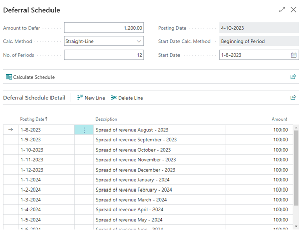

# Manual Base Functionality
This manual describes how to set up and use the Base Functionality app.

## Adjusted Date Formula
If you will enter -2M in the Adjusted Date Formula, the schedule will start 2 months earlier:

[:arrow_left:](../README.md) [Back](../README.md)