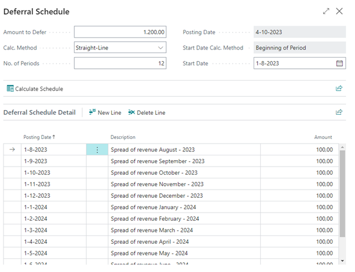

# Manual Base Functionality
This manual describes how to set up and use the Base Functionality app.

## Deferral Templates
In standard BC you already have the possibility to create deferral templates. Base Functionality has an extra possibility: **Adjusted date formula**.
In this document we will explain the standard procedure and the adjusted date formula.

| **Field Name**  | **Description** |
| ------------- | ------------- |
| Deferral code  | Unique deferral code for the template.  |
| Description  | Description of the deferral template.  |
| Deferral account  | The ledger account for posting the deferred costs.  |
| Deferral %  | The percentage of the deferred amount.  |
| Calculation method  |<ul><li>Straight-line</li><li>Equal amount per Period</li><li>Days per Period</li><li>User-defined</li><li>In practice we always use straight-line.</li><li>In this document we will give examples of all methods.</li></ul>|
| Start Date  | <ul><li>Posting Date</li><li>Beginning of Period</li><li>End of Period</li><li>Beginning of next period</li><li>Beginning of next calendar year</li></ul>  |
| No. of periods  | Specifies how many accounting periods the total amounts will be deferred to.  |
| Period description  | <ul><li>%1 = No of day</li><li>%2 = No of week</li><li>%3 = Month as number</li><li>%4 = Written month</li><li>%5 = Written month</li><li>%6 = Year</li></ul>  |
| Adjusted Date Formula  | -1M   As a result, the first booking is not made on the entered start date, but 1 month earlier.  |

More information on how this works can be found in the section: [Use Deferral Templates](use-deferral-templates.md).

## Calculation Method
When creating a deferral template, we can indicate what the calculation method is.

### Straight-Line
This means that the amounts are evenly distributed over the periods.
The beginning period (start date) is very important.
If the starting date is on the 1st of the month, all periods will be the same. 
Do we start eg on 10-11-2022 then the amount will be calculated pro rata.

### Equal per Period
If we choose Equal per Period as the method, the amounts will be the same (100) in all periods, regardless of the start date. 

### Days per Period
If we choose Days per Period, the 1st period will be calculated based on the start date. If this is still on 10-10-23, 22 days are calculated. The amounts are calculated as follows: Total amount to be distributed (1200) / 365 days (year).

### User-defined
Finally, the User Defined method. If we choose this method, we will have to divide the amounts manually ourselves. The total amount distributed must of course be equal to the amount to be distributed.

## Adjusted Date Formula
If you will enter -2M in the Adjusted Date Formula, the schedule will start 2 months earlier:

[:arrow_left:](../README.md) [Back](../README.md)