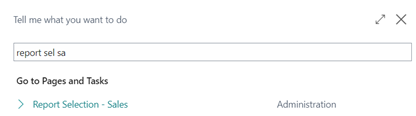
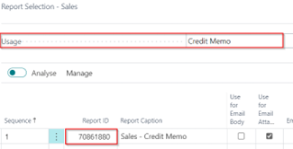
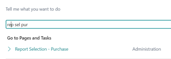
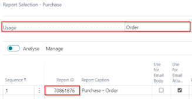
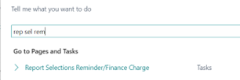
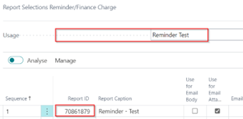
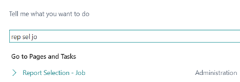

# Manual Base Functionality
This manual describes how to set up and use the Base Functionality app.

## Standard document layouts
With Base Functionality you can give the following documents all the same look and feel:
*	Project Quote
*	Purchase Quote
*	Purchase Order
*	Reminder (Test)
*	Sales Quotation
*	Sales Order Confirmation
*	Draft Invoice
*	Sales Proforma Invoice
*	Sales Invoice
*	Sales Credit Memo

To select these reports as standard in your company, follow this procedure:

## Sales Reports
Choose the Search icon, enter report selection sales, and the choose the related link. 

Now you can select  for each usage the corresponding report:

| **Usage**  | **ReportID** | **Report Caption** |
| ------------- | ------------- | ----------- |
| Quote  | 70861885 | Sales - Quote |
| Order  | 70861883 | Sales - Confirmation |
| Draft Invoice  | 70861881 | Draft Invoice |
| Pro Forma Invoice  | 70861884 | Pro Forma Invoice |
| Invoice  | 70861882 | Sales - Invoice |
| Credit Memo  | 70861880 | Sales - Credit Memo |

## Purchase Reports
Choose the Search icon, enter report selection Purchase, and the choose the related link. 

Now you can select  for each usage the corresponding report:

| **Usage**  | **ReportID** | **Report Caption** |
| ------------- | ------------- | ----------- |
| Quote  | 70861877 | Purchase - Quote |
| Order  | 70861876 | Purchase - Confirmation |

## Reminder
Choose the Search icon, enter report selection Reminder, and the choose the related link. 

Now you can select  for each usage the corresponding report:

| **Usage**  | **ReportID** | **Report Caption** |
| ------------- | ------------- | ----------- |
| Reminder  | 70861878 | Reminder |
| Reminder Test  | 70861879 | Reminder Test |

## Job
Choose the Search icon, enter report selection Job, and the choose the related link. 

Now you can select  for each usage the corresponding report:

| **Usage**  | **ReportID** | **Report Caption** |
| ------------- | ------------- | ----------- |
| Quote  | 70861875 | Job - Quote |

[:arrow_left:](../README.md) [Back](../README.md)