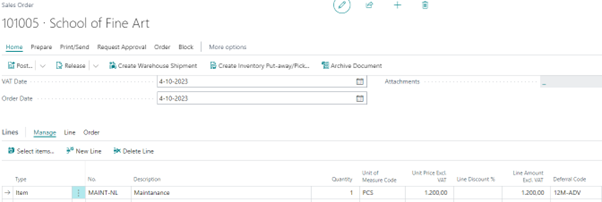
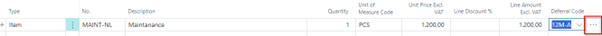
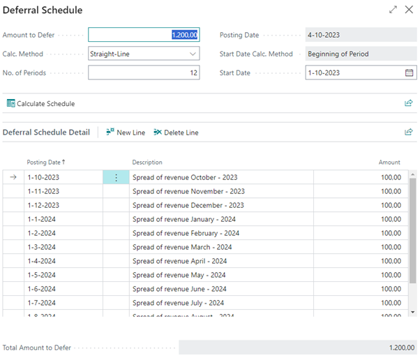

# Manual Base Functionality
This manual describes how to set up and use the Base Functionality app.

## Use Deferral Templates
A deferral code can be selected in the following documents:
*	Purchase Order Line
*	Purchase Invoice Line
*	Purchase Credit Memo Line
*	Sales Order Line
*	Sales Invoice Line
*	Sales Credit Memo Line

_Via personalization you can ensure that the deferral code becomes visible on your line._

In this example we assume a sales order line.

> [!IMPORTANT]
> The deferral code must be entered on the line after the amount is entered.

The deferral code will ensure that the turnover is spread over 12 months. 
We can see in advance how the amounts will be distributed. On the right side of the deferral code you will see 3 dots.  If we press this we will see the intended schedule:

[:arrow_left:](../README.md) [Back](../README.md)